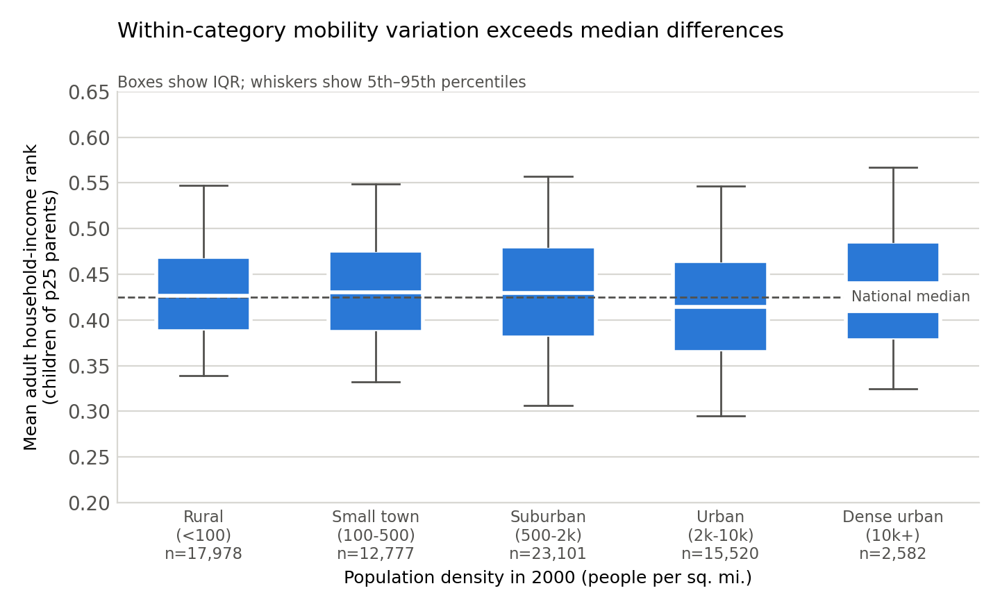
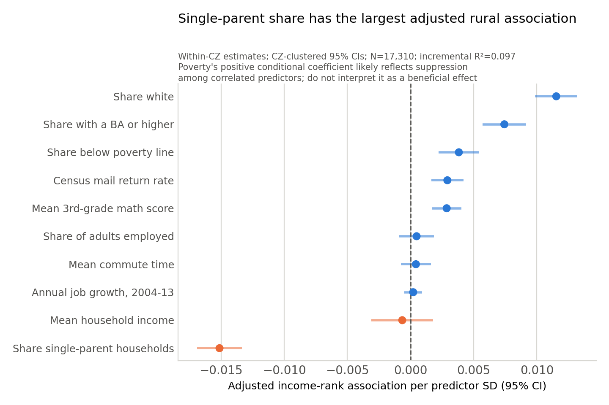

# Which rural places move kids up?

**QSS 20 final project — Max Fortner (solo).** Project option: Senior Thesis / Own Data.

**Research question:** what distinguishes rural Census tracts with above-average upward
mobility from otherwise similar rural tracts with below-average mobility?

Using the Opportunity Insights Opportunity Atlas, I merge tract-level upward-mobility
outcomes for the 1978–1983 birth cohorts onto tract-level neighborhood characteristics.
The raw covariate file contains 74,044 tracts; the usable merged sample contains 71,958.
I compare mobility across density categories, then estimate conditional associations
among rural tracts using commuting-zone fixed effects and standard errors clustered by
commuting zone. I also screen out estimates based on fewer than 200 children and compare
the adjusted rural pattern with dense-urban tracts.

The adjusted rural model still identifies single-parent household share as the largest
association: a one-SD increase corresponds to a 1.5-percentile-point lower mean adult
household-income rank (`95% CI: -1.69 to -1.34` points). The estimate is similar after
the 200-child screen (-1.6 points). Rural and dense-urban coefficients are also shown on
a common pooled-SD scale, but the dense-urban comparison is exploratory because it
contains only 28 commuting-zone clusters.

## Code

Run the notebooks in numeric order. Each defines its functions at the top and imports
shared paths and variable names from [`code/utils.py`](code/utils.py), so no path is
hardcoded to one machine.

| Notebook | Takes in | Does | Outputs |
|---|---|---|---|
| [`code/00_pull.ipynb`](code/00_pull.ipynb) | — (downloads from the web) | Downloads the two Opportunity Insights Atlas tables into `data/`, skipping files already present. Prints row counts, duplicate-id checks, and missing-cell counts on the key fields. | `data/tract_outcomes_simple.csv`, `data/tract_covariates.csv` |
| [`code/01_merge.ipynb`](code/01_merge.ipynb) | `data/tract_outcomes_simple.csv`, `data/tract_covariates.csv` | Validates a one-to-one inner join on `(state, county, tract)`, prints row-loss diagnostics, retains the child count used for precision screening, constructs density categories, and audits missing cells. | `data/analysis_sample.csv`, `output/table2_missing_cells.tex` |
| [`code/02_analyze.ipynb`](code/02_analyze.ipynb) | `data/analysis_sample.csv` | Fits standardized OLS models with commuting-zone fixed effects and commuting-zone-clustered standard errors, checks a 200-child minimum sample, compares rural with dense-urban tracts, and diagnoses predictor correlations. | `output/fig1_mobility_by_density.png`, `output/fig2_rural_ols_coefficients.png`, `output/fig3_rural_dense_coefficients.png`, `output/table1_analysis_sample.tex`, `output/table3_ols_results.tex`, `output/table4_count_sensitivity.tex` |
| [`code/utils.py`](code/utils.py) | — | Shared paths, data-source URLs, key variable names, density bins, covariate list, figure palette. | — |

Install the reproducible environment with `python -m pip install -r requirements.txt`.
Open Jupyter from `code/` and run the notebooks in numeric order. All generated CSVs
are excluded by `.gitignore`; raw data are recovered by running `00_pull.ipynb`.

## Data

Not committed — see [`data/README.md`](data/README.md) for the download links.
`00_pull.ipynb` fetches both raw files automatically.

- **Source:** [Opportunity Insights Opportunity Atlas](https://opportunityinsights.org/data/), tables 4 and 9
- **Unit of analysis:** 2010 Census tract, keyed to where a child grew up
- **Time window:** outcomes for the 1978–1983 birth cohorts measured in adulthood
  (~2014–2015) from federal tax records; covariates measured in 2000 except where the
  variable name says otherwise
- **Primary outcome:** `kfr_pooled_pooled_p25` — mean adult household income rank for
  children whose parents were at the 25th percentile
- **Rural definition:** fewer than 100 people per square mile in 2000. This is a
  transparent project-specific density cutoff, not the Census Bureau's official
  rural classification.
- **Missing cells:** rates vary by field and sample. Job growth has the highest
  overall missing rate, while Census mail-return missingness is higher among rural
  tracts. See `output/table2_missing_cells.tex`; models use complete cases and print
  the resulting row loss.

## Output

| File | What it is |
|---|---|
| [`output/fig1_mobility_by_density.png`](output/fig1_mobility_by_density.png) | Distribution of tract mobility across five population-density categories |
| [`output/fig2_rural_ols_coefficients.png`](output/fig2_rural_ols_coefficients.png) | OLS coefficients per SD with 95% CIs, rural tracts only |
| `output/fig3_rural_dense_coefficients.png` | Exploratory adjusted comparison using common pooled rural+dense-urban predictor SDs |
| `output/table1_analysis_sample.tex` | Sample characterization |
| `output/table2_missing_cells.tex` | Cells with no value, by field, overall and among rural tracts |
| `output/table3_ols_results.tex` | Main within-commuting-zone rural OLS results |
| `output/table4_count_sensitivity.tex` | Main coefficients compared with the 200-child minimum sample |

## Writeup

[`writeup/milestone1_fortner.pdf`](writeup/milestone1_fortner.pdf) — Milestone 1 memo
(source: [`writeup/milestone1_fortner.tex`](writeup/milestone1_fortner.tex)).

## Caveats

These are descriptive conditional associations on cross-sectional tract data, not
causal estimates. Commuting-zone fixed effects address broad geographic composition but
do not eliminate family sorting or unobserved tract differences. Several predictors are
strongly correlated, so coefficients that reverse their bivariate signs are treated as
possible suppression patterns rather than independent effects. Some covariates were
also measured after the focal cohorts' childhood years.
